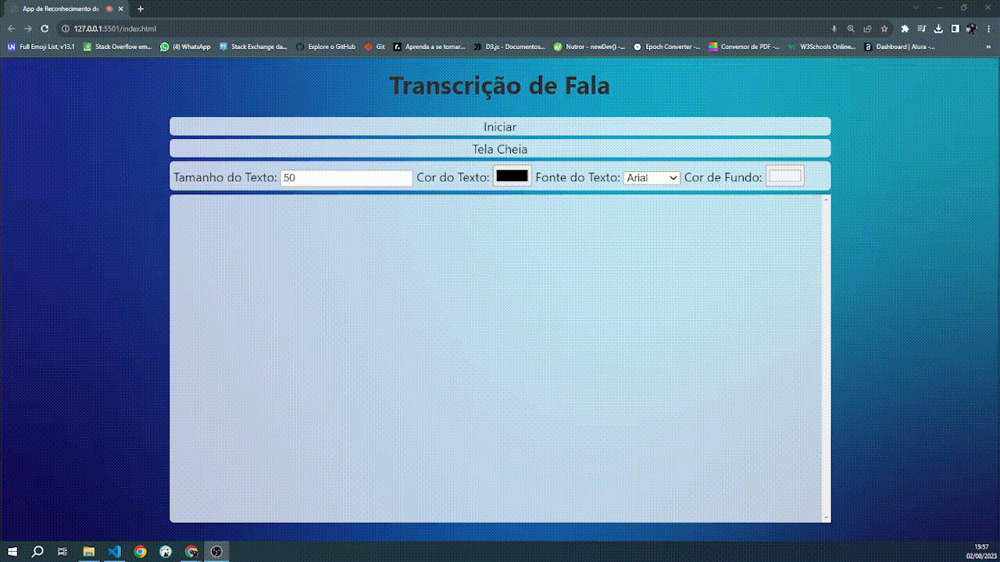
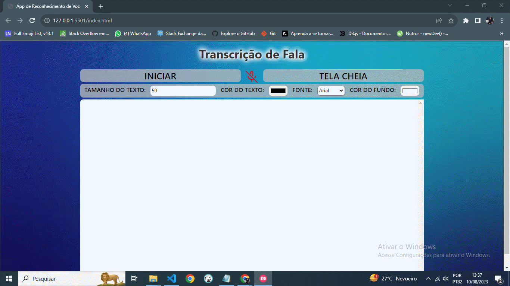

# 🎤 Voz em Letras - Reconhecimento de Fala Inteligente

Uma aplicação web moderna e responsiva para reconhecimento de fala com tradução em tempo real, desenvolvida com tecnologias web nativas.



## ✨ Funcionalidades Principais

### 🎯 Reconhecimento de Fala
- **Reconhecimento em tempo real** usando Web Speech API
- **Tradução automática** entre diferentes idiomas
- **Interface moderna e responsiva** com design Material Design
- **Modo tela cheia** para apresentações e acessibilidade
- **Personalização completa** de fonte, cores e tamanhos

### 🛠️ Ferramentas Úteis
- **Copiar texto** para área de transferência
- **Download** da transcrição como arquivo .txt
- **Limpar transcrição** com um clique
- **Atalhos de teclado** para operação rápida
- **Notificações** de status em tempo real

### 🌍 Idiomas Suportados (35+)
- **Português** (Brasil 🇧🇷 e Portugal 🇵🇹)
- **Inglês** (EUA 🇺🇸 e Reino Unido 🇬🇧)
- **Espanhol** (Espanha 🇪🇸, México 🇲🇽, Argentina 🇦🇷)
- **Francês** 🇫🇷, **Italiano** 🇮🇹, **Alemão** 🇩🇪
- **Japonês** 🇯🇵, **Coreano** 🇰🇷, **Chinês** 🇨🇳
- **Árabe** 🇸🇦, **Hindi** 🇮🇳, **Russo** 🇷🇺
- **E muitos outros...**

## 🚀 Como Usar

### Requisitos Mínimos
- ✅ **Navegador compatível**: Chrome, Edge, Firefox
- ✅ **Microfone** funcionando
- ✅ **Conexão com internet** (para tradução)
- ✅ **HTTPS** recomendado para melhor funcionamento

### Instalação Rápida
1. **Clone ou baixe** este repositório
2. **Abra** o arquivo `index.html` em um navegador compatível
3. **Permita** o acesso ao microfone quando solicitado
4. **Comece a falar!** 🎤

### Atalhos de Teclado
- **Espaço**: Iniciar/Pausar reconhecimento
- **F11**: Ativar/Desativar tela cheia
- **Escape**: Sair da tela cheia

## 🎨 Personalização Avançada

### Aparência
- **Tamanho da fonte**: 50px a 300px
- **Cor do texto**: Seletor de cores completo
- **Família da fonte**: 10+ opções (Inter, Lora, Arial, etc.)
- **Cor de fundo**: Personalização total

### Configuração de Idiomas
- **Idioma de entrada**: O idioma que você fala
- **Idioma de saída**: O idioma em que o texto aparece
- **Tradução automática**: Quando os idiomas são diferentes

## 🔧 Estrutura do Projeto

```
reconhecimento-de-fala/
├── 📄 index.html          # Página principal refatorada
├── 🎨 style.css           # Estilos modernos e responsivos  
├── ⚙️ main.js             # JavaScript refatorado e modular
├── 🌐 translation.js      # Módulo de tradução
├── 📖 README.md           # Esta documentação
└── 🖼️ images/             # Recursos visuais
    ├── fundo.jpg          # Imagem de fundo
    ├── micoff.svg         # Ícone microfone desligado
    ├── micon.svg          # Ícone microfone ligado
    └── inclusao.gif       # Animação demonstrativa
```

## 💡 Tecnologias e Melhorias

### Stack Tecnológico
- **HTML5**: Estrutura semântica moderna
- **CSS3**: Design responsivo com variáveis CSS
- **JavaScript ES6+**: Módulos, async/await, arquitetura orientada a objetos
- **Web Speech API**: Reconhecimento de fala nativo do navegador
- **MyMemory Translation API**: Tradução em tempo real
- **Font Awesome**: Ícones vetoriais modernos
- **Google Fonts**: Tipografia otimizada

### Melhorias Implementadas ✨
- ✅ **Interface completamente redesenhada** com design moderno
- ✅ **35+ idiomas adicionados** com variações regionais
- ✅ **Layout responsivo** para mobile e desktop
- ✅ **Botões de ação** (copiar, download, limpar)
- ✅ **Sistema de notificações** em tempo real
- ✅ **Atalhos de teclado** para produtividade
- ✅ **Refatoração completa** do código JavaScript
- ✅ **Arquitetura modular** e escalável
- ✅ **Tratamento robusto** de erros
- ✅ **Auto-hide** dos controles
- ✅ **Animações suaves** e transições

## ⚠️ Limitações Conhecidas

### Compatibilidade
- **Navegadores**: Melhor performance no Chrome/Edge
- **Mobile**: Funcionalidade limitada em alguns dispositivos
- **HTTPS**: Necessário para acesso ao microfone em produção

### Reconhecimento
- **Pausas longas**: Podem interromper a transcrição
- **Ruído ambiente**: Pode afetar a precisão
- **Sotaques regionais**: Precisão pode variar

## 🛡️ Privacidade e Segurança

- 🔒 **Processamento local**: Reconhecimento feito no navegador
- 🚫 **Sem armazenamento**: Nenhum dado permanente
- 🌐 **API externa**: Apenas para tradução opcional
- 📖 **Código aberto**: Totalmente transparente

## 🚀 Versões e Atualizações

### v3.0 (Atual) - Refatoração Completa
- Interface moderna com Material Design
- 35+ idiomas suportados
- Funcionalidades avançadas de texto
- Código completamente refatorado

### v2.0 (Anterior)
- Funcionalidades básicas de reconhecimento
- Tradução simples
- Interface original

## 📝 Licença

Projeto de código aberto sob licença MIT. Use, modifique e distribua livremente.

---

**🎯 Desenvolvido para democratizar o acesso à tecnologia de reconhecimento de fala**

*Se este projeto foi útil, considere dar uma ⭐ no repositório!*


Captação de Áudio através de uma Ferramenta dos Navegadores e Transcrição de Forma Dinâmica do Conteúdo Gerado. Possibilidade de Configuração do Texto, Cores, Tamanhos, Fontes e Cor de Fundo, Auxiliando na Visualização em Diversos Contextos.

Aplicação desenvolvida com JavaScript, HTML5 e CSS3.

## Pré-requisitos

Internet para acesso do link: "https://vozemletras.netlify.app/"  
Microfone para captação do Áudio  
Para teste local clone o projeto e utilize a extensão LiveServer : ritwickdey.LiveServer


## Uso

Abra o Nagevador Aceite o acesso ao microfone que será solicitado pelo navegador e clique em Iniciar. 
Se preferir poderá Alterar as configurações de Texto como Tamanho da fonte, cor e estilo. Assim tambem em 
relação ao cor de fundo que pode ser ajustada.
Modo de exibição em tela cheia disponível

## 🛠 Ferramentas

- [JavaScript](https://developer.mozilla.org/pt-BR/docs/Web/JavaScript)
- [HTML](https://developer.mozilla.org/pt-BR/docs/Web/HTML)
- [CSS](https://developer.mozilla.org/pt-BR/docs/Web/CSS)

## Contribuição

Se você tem alguma Sugestão enviar para devandersonmotta@gmail.com com o assunto: "contribuição reconhecimento de fala" ou pelo Linkedin link em contato.

## Licença

MIT

## Contato

email: devandersonmotta@gmail.com

linkedin: www.linkedin.com/in/anderson-motta-96b138235
---

## Objetivo

Sempre tive em mente a vontade de ajudar minha comunidade e aplicar meus conhecimentos de forma significativa. Um dia, enquanto estava na igreja, ouvi uma brincadeira do Padre: "Aqui não tem ninguém surdo, né?" Isso me fez refletir sobre como as pessoas com problemas auditivos enfrentam desafios para acompanhar certas situações.

Foi então que, diante do Projetor da Igreja, surgiu a ideia deste sistema inovador. O projeto ainda está em fase inicial, mas estou determinado a torná-lo uma realidade que beneficiará a todos. Meu objetivo é implementá-lo gratuitamente em todas as comunidades, para que a inclusão seja uma realidade para todos.

Acredito que, com a ajuda de Deus e de todos que compartilham dessa visão, poderemos impactar positivamente a vida daqueles que enfrentam dificuldades de audição. Vamos juntos fazer a diferença e promover uma sociedade mais inclusiva!

