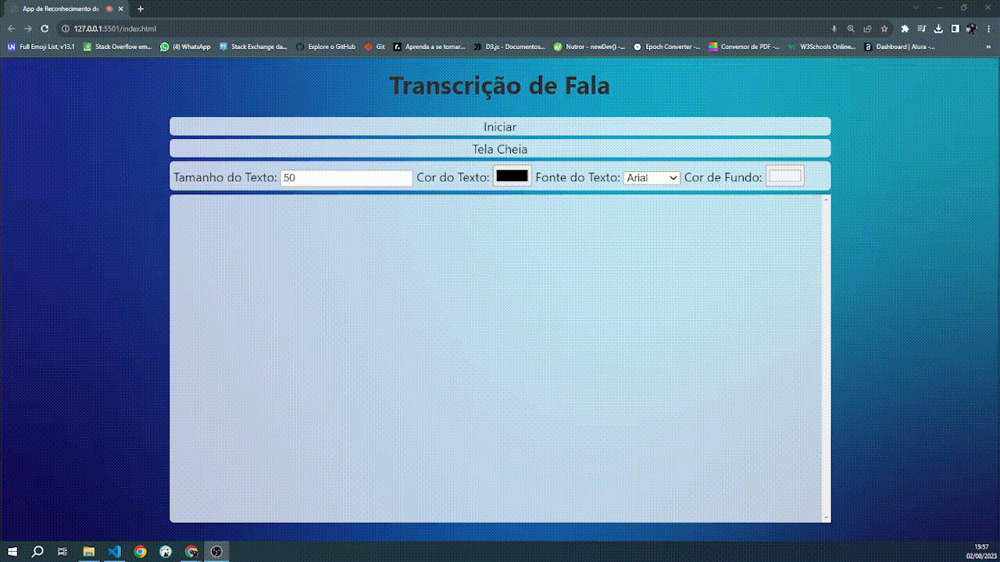

# Reconhecimento de Fala

Captação de Áudio através de uma Ferramenta dos Navegadores e Transcrição de Forma Dinâmica do Conteúdo Gerado. Possibilidade de Formatação do Texto com Cores, Tamanhos e Fontes, Auxiliando na Visualização em Diversos Contextos.

Aplicação desenvolvida com JavaScript, HTML5 e CSS3.

## Pré-requisitos

Internet para acesso do link: "link não gerado V1"
Microfone para captação do Áudio
Para teste local utilize a extensão LiveServer : ritwickdey.LiveServer

## Uso

Abra o Nagevador Aceite o acesso ao microfone que será solicitado pelo navegador e clique em Iniciar. 
Se preferir poderá Alterar as configurações de Texto como Tamanho da fonte, cor e estilo. Assim tambem em 
relação ao cor de fundo que pode ser ajustada.
Modo de exibição em tela cheia disponível

## Contribuição

Se você tem alguma Sugestão enviar para devandersonmotta@gmail.com com o assunto: "contribuição reconhecimento de fala" ou pelo Linkedin link em contato.

## Licença

MIT

## Contato

email: devandersonmotta@gmail.com
linkedin: www.linkedin.com/in/anderson-motta-96b138235
---

## Objetivo

Sempre tive em mente a vontade de ajudar minha comunidade e aplicar meus conhecimentos de forma significativa. Um dia, enquanto estava na igreja, ouvi uma brincadeira do Padre: "Aqui não tem ninguém surdo, né?" Isso me fez refletir sobre como as pessoas com problemas auditivos enfrentam desafios para acompanhar certas situações.

Foi então que, diante do Projetor da Igreja, surgiu a ideia deste sistema inovador. O projeto ainda está em fase inicial, mas estou determinado a torná-lo uma realidade que beneficiará a todos. Meu objetivo é implementá-lo gratuitamente em todas as comunidades, para que a inclusão seja uma realidade para todos.

Acredito que, com a ajuda de Deus e de todos que compartilham dessa visão, poderemos impactar positivamente a vida daqueles que enfrentam dificuldades de audição. Vamos juntos fazer a diferença e promover uma sociedade mais inclusiva!

